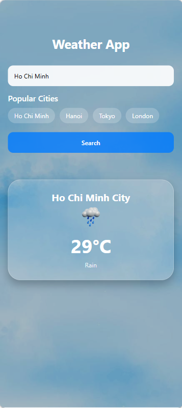
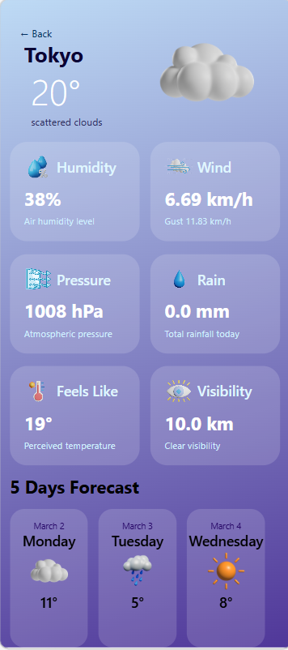

# 🌤️ Weather App

A simple and modern Weather Application built with **React Native (Expo)**.  
This app allows users to search for a city and view real-time weather information including temperature, humidity, wind speed, and weather conditions.

---

## 📱 Features

- 🔍 Search weather by city name
- 🌡️ Display current temperature
- 💧 Show humidity
- 🌬️ Show wind speed
- 🌥️ Weather condition with icons
- 📄 Detail screen for more information
- 📱 Clean and responsive UI

---

## 🛠️ Technologies Used

- React Native
- Expo
- TypeScript
- OpenWeather API (or your weather API name)
- React Navigation

---
## 📸 Demo Screenshots

### 🏠 Home Screen

### 📄 Detail Screen

